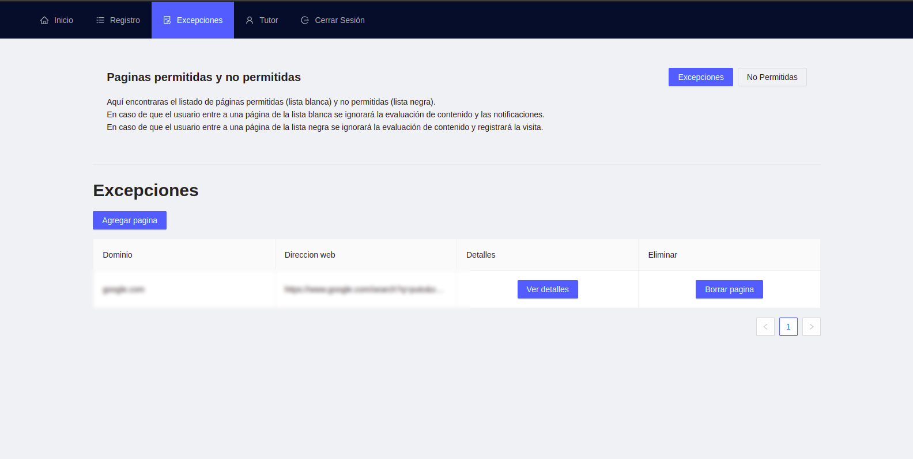

<a name="readme-top"></a>

<!-- PROJECT LOGO -->
<br />
<div align="center">
  <a href="https://github.com/Eliel0328/2021-B065-Extension">
    
  </a>

  <h3 align="center">
  Trabajo Terminal 2021-B065: Detector de texto ofensivo durante la navegación Web - Plataforma para Tutores (Vigilante)</h3>

  <p align="center">
  <a href="https://github.com/Eliel0328/2021-B065-Extension"><strong>Revisar documento técnico »</strong></a>
  <br>
  <br>
  <a href="https://github.com/Eliel0328/2021-B065-Extension/issues">Reportar Error</a>
    ·
    <a href="https://github.com/Eliel0328/2021-B065-Extension/issues">Solicitar Función</a>
  </p>
</div>

<!-- TABLE OF CONTENTS -->
<details>
  <summary>Contenido</summary>
  <ol>
    <li>
      <a href="#acerca-del-proyecto">Acerca del Proyecto</a>
      <ul>
        <li><a href="#extensión-web">Extensión Web</a></li>
      </ul>
      <ul>
        <li><a href="#desarrollado-con">Desarrollado Con</a></li>
      </ul>
    </li>
    <li>
      <a href="#guía-de-instalación">Guía de Instalación</a>
      <ul>
        <li><a href="#prerequisitos">Prerequisitos</a></li>
        <li><a href="#instalación">Instalación</a></li>
      </ul>
    </li>
    <li><a href="#manual-de-uso">Manual de Uso</a></li>
  </ol>
</details>

<!-- ABOUT THE PROJECT -->

## Acerca del Proyecto

<div align="center">
    
</div>

<p style="text-align: justify;">
La creciente relación humana con los medios digitales nos ha llevado a una dependencia de esta tal que su uso no se ha limitado por edades dado que en la actualidad es necesario en algunos casos que los niños hagan uso de estas herramientas, dejándolos expuestos a un posible encuentro con lenguaje ofensivo en modo texto o en su defecto manejar lenguaje ofensivo
</p>

<p style="text-align: justify;">
Para entender qué es el lenguaje ofensivo se debe revisar antes la definición de sus componentes, por lo tanto, según definiciones de la RAE el lenguaje es la facultad del ser humano de expresarse y comunicarse con los demás a través del sonido articulado o de otros sistemas de signos, es un sistema de comunicación que tiene como característica un estilo y modo de hablar y escribir de cada persona en particular. Mientras que la definición de un acto ofensivo sería todo aquel que tenga como objetivo humillar o herir el amor propio o la dignidad de alguien, puede considerarse también actos donde se dañen físicamente o maltraten a otra persona. Por lo tanto, en este trabajo el lenguaje ofensivo se definirá como “todas aquellas expresiones, palabras o texto que sean discriminatorias, despectivas y que tengan como propósito dañar a otra persona o grupo”.
</p>

<p style="text-align: justify;">
Las extensiones web (también conocidos como add-ons) son aquellos aditamentos que se pueden agregar en los navegadores web (Google Chrome, Mozilla Firefox, entre otros) y que permiten realizar actividades en específico por lo que es posible interactuar con el contenido del HTML, de esta forma se puede saber el contenido de la página y hace posible el análisis para detectar el uso de lenguaje ofensivo. Para realizar este análisis se desarrollará un software que estará alojado en un servidor, el cual se comunicará con la extensión para obtener el contenido de las páginas visitadas durante la navegación mientras la extensión esté activa.
</p>

<p style="text-align: justify;">
El sistema detecta el contenido de la navegación de los tutorados y notifica al tutor si se trata o hace uso de lenguaje ofensivo. Nuestro sistema se une a los diversos sistemas que tienen como objetivo detectar un acto ofensivo o discriminatorio los cuales se enfocan en detectar actos como el bullying, el acoso, el sexismo, racismo o algún otro acto ofensivo o denigrante. La diferencia sustancial es el método empleado para detectar su tema, en nuestro caso el lenguaje ofensivo es detectado por medio del análisis del texto de la página web, otra diferencia es el acto posterior al detectarlo pues lo que se realiza en nuestro sistema es enviar una notificación al tutor para que su criterio sea usado para juzgar el contenido visitado. De esta manera actos como el acosar o ser acosado en redes sociales, seguir discursos de odio, presenciar casos de racismo o participar en ellos, acceder a contenido para adultos, entre otras actividades podrían ser detectadas, prevenidas y discutidas por los involucrados (tutor y tutorado) para llegar a la mejor solución posible sin invadir la navegación o censurar el contenido directamente.
</p>

### Plataforma web - Plataforma de registro y monitoreo para tutores

La plataforma web trabaja en forma conjunta al resto del sistema. Las funciones realizadas son las siguientes:

-   Registrar cuenta de tutor.
-   Establecer configuración para el funcionamiento de la extensión.
-   Ver el contenido clasificado.
-   Calificar el contenido clasificado.
-   Ver estadisticas de clasificacion.

<p align="right">(<a href="#readme-top">volver al inicio</a>)</p>

### Desarrollado con

En esta sección se listan los principales frameworks utilizados para el arranque y desarrollo de la extension.

-   
-   
-           
-   
-   
-   

<p align="right">(<a href="#readme-top">volver al inicio</a>)</p>

<!-- GETTING STARTED -->

## Guía de instalación

Este es un ejemplo de configuracion.

### Prerequisitos

-   `Node v16` o superior

### Instalación

_A continuación se muestran algunas opciones del proceso de instalación_

` 2. Clonar el repositorio.

```sh
git clone https://github.com/Eliel0328/2021-B065-Servidor-Web.git
```

3. Instalar los paquetes necesario NPM.
    ```sh
    npm install
    ```
4. Ingrese los datos de Mongo en un nuevo archivo `.env.development.local` generado por usted.
    ```sh
       REACT_APP_API_BASE_URL={Direccion de Servidor web}
    ```

<p align="right">(<a href="#readme-top">volver al inicio</a>)</p>

## Manual de Uso

A continuación se muestra como usar la plataforma

_Revisar [Documento Técnico](https://www.google.com.mx/)_

### Crear cuenta

Para crear una cuenta se debe tener en cuenta los siguientes datos.

-   Nombre(s)
-   Apellido(s)
-   Correo personal (no viculado a otra cuenta)
-   Contraseña (debe tener al menos 8 caracteres, una minuscula, mayuscula, número y caracter especial)

Estos datos deben ser ingresados en el siguiente formulario. En caso de ser correctos se creara una cuenta para acceder a las funciones ya mencionadas.

<div align="center">
    
</div>

### Iniciar Sesión

Para iniciar sesión es necesario usar el correo y contraseña vinculado a la cuenta.

<div align="center">
    
</div>

### Funciones en plataforma

#### Página principal

Aqui encontrará información y manuales de uso de la plataforma y la extensión. Además, de información de contacto para el reporte de errores o solicitudes de nuevas funciones.

<div align="center">
    
</div>

#### Registro de contenido ofensivo encontrado

En esta sección encontrará un resumen de la información clasificada.

<div align="center">
    
</div>

Además en esta opción se podrá calificar el contenido clasificado.

<div align="center">
    
</div>

#### Páginas permitidas y no permitidas

En esta sección se podra registrar páginas para evitar el analisis o para registrar sus visitas según la preferencias del tutor.

<div align="center">
    
</div>

#### Página de tutor

En esta sección será posible configurar el número de incidencias para su registro, enceder o apagar la extensión. Además, podrá ver la estadistica del contenido clasificado.

<div align="center">
    
</div>

<p align="right">(<a href="#readme-top">volver al inicio</a>)</p>
